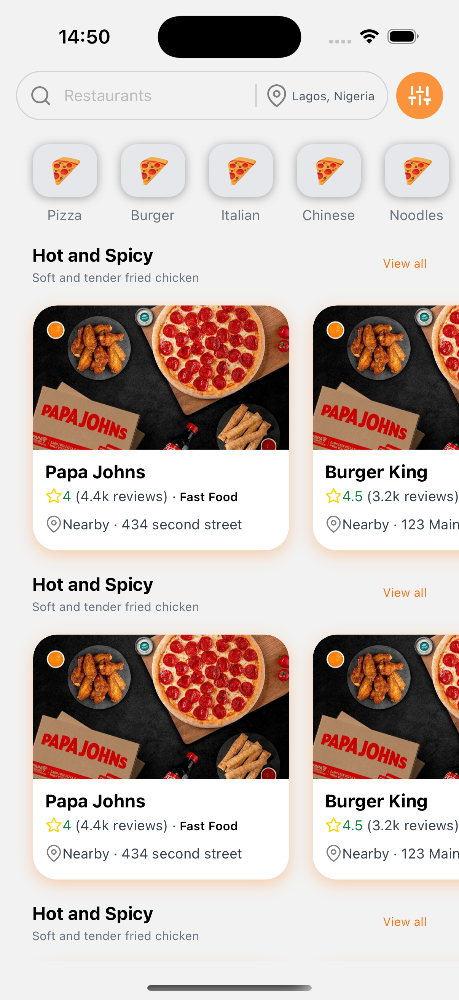
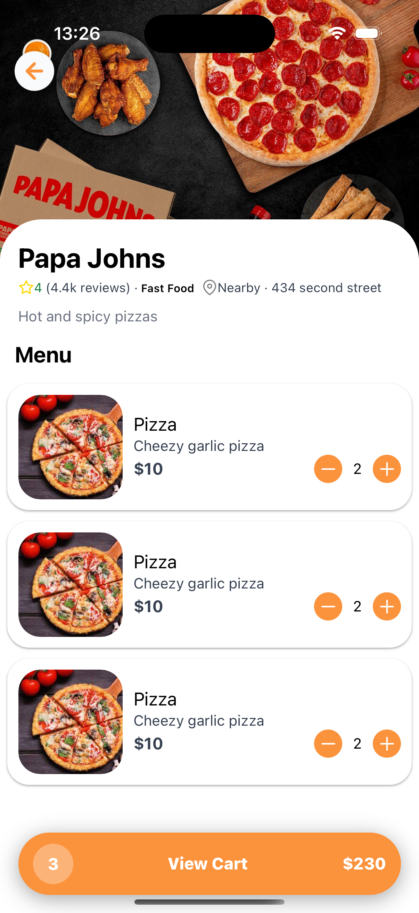
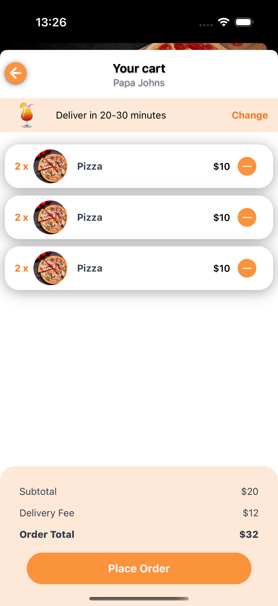
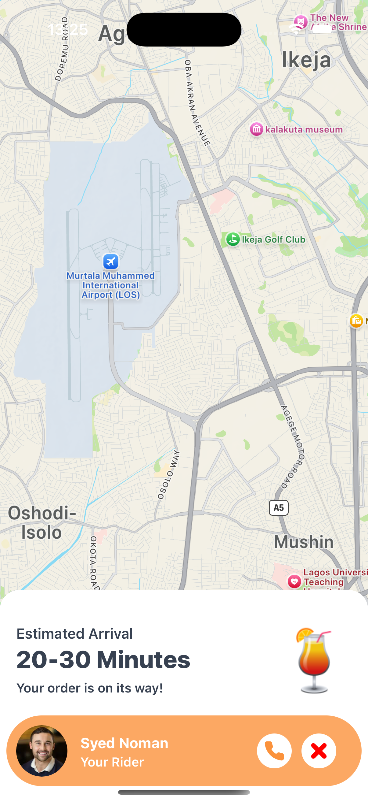

## Project Overview

This project showcases the seamless integration of Tailwind CSS with React Native to build a responsive and visually appealing food delivery mobile application for restaurants. The app leverages the utility-first approach of Tailwind CSS to style components efficiently, ensuring a consistent and modern design across different screens.

### Key Features

- **Responsive Design**: Adapts to various screen sizes and orientations.
- **Utility-First Styling**: Uses Tailwind CSS for quick and maintainable styling.
- **Cross-Platform**: Runs smoothly on both iOS and Android devices.

Below are some screenshots showcasing the app's interface:

### Screenshots

    

        
        
Home Screen

    

    

        
        
Restaurant Menu

    

        
        
Restaurant Menu

    

        

        
        
Restaurant Menu

    

